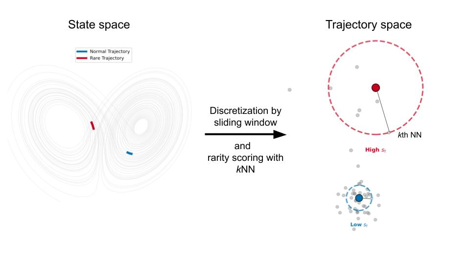

# Trajectory kNN

A Python package for detecting anomalies in spatiotemporal data (e.g. from netCDF files) using k-nearest neighbors approaches on trajectory embeddings. Implemented in PyTorch for efficient CPU and GPU parallel computation.



## Overview

This repository provides efficient algorithms to identify rare or anomalous spatiotemporal patterns in multidimensional time series data. The method works by:

1. Constructing trajectory embeddings from consecutive time steps
2. Computing distances between trajectories in the spatiotemporal space
3. Identifying anomalies based on k-nearest neighbor distances

Multiple implementations are provided to handle various memory and computational constraints:
- **Standard algorithm**: Full distance matrix computation with trajectory recurrence
- **Low-memory variant**: Reduced memory footprint for large datasets
- **FAISS-based**: GPU-accelerated using Facebook's FAISS library
- **Exclusion zone**: Prevents trivial matches in time series data

## Features

- PyTorch-based implementation enabling seamless CPU/GPU computation
- Support for netCDF file formats (xarray integration)
- Efficient blocked computation for large datasets
- Trajectory-based anomaly scoring with configurable exclusion zones
- Ready-to-use case studies and benchmarking scripts

## Installation

### Using Conda (Recommended)

Create the conda environment with the required dependencies:

```bash
conda env create -f environment.yml


# Optional (baseline only)
# For FAISS CPU support
conda env create -f env_faiss_cpu.yml
# For FAISS GPU support
conda env create -f env_faiss_gpu.yml
```

Activate the environment:

```bash
conda activate trajectory_knn
```

### Install the package

```bash
pip install -e .
```

## Usage

### Basic Example

```python
from src.rarity_scoring_base import knn_scores

# Compute anomaly scores for a netCDF file
scores = knn_scores(
    nc_path="path/to/your/data.nc",
    var="variable_name",
    traj_length=5,         # Length of trajectory embeddings (e.g., 5 days)
    k=10,                  # Number of nearest neighbors
    q_batch=1024,          # Query batch size
    r_chunk=1024,          # Reference chunk size
    device="cuda",         # Use "cpu" or "cuda"
    exclusion_zone=10      # Temporal exclusion zone
)
```

### Case Studies

The `case_studies/` directory contains real-world applications:

```bash
# Run the sea level pressure anomaly detection example
python case_studies/msl.py
```

### Runtime Experiments and Benchmarks

Compare different implementations:

```bash
# Run standard algorithm
python experiments/myalgo.py

# Run low-memory variant
python experiments/myalgo_lowmem.py

# Run FAISS GPU implementation
python experiments/faiss_gpu_only.py

# Run FAISS CPU implementation
python experiments/faiss_cpu_only.py
```

## Algorithm Description

The core algorithm computes anomaly scores based on the mean distance to k-nearest neighbors in trajectory space:

1. **Distance Computation**: Compute distances between all trajectory pairs using efficient blocked matrix operations. The implementation uses a recurrence relation to efficiently update trajectory distances as the time window slides, avoiding redundant computations.
2. **KNN Scoring**: For each trajectory, find the k-nearest neighbors and compute the mean distance


## Project Structure

```
.
├── src/
│   ├── rarity_scoring_base.py            # Standard KNN anomaly detection
│   ├── rarity_scoring_with_exlcusion.py  # Version with exclusion zone
│   ├── analogue_traj.py                  # Trajectory analogue computation
│   └── utils.py                          # Utility functions
├── experiments/
│   ├── myalgo.py                       # Benchmark standard algorithm
│   ├── myalgo_lowmem.py                # Benchmark low-memory variant
│   ├── faiss_cpu_only.py               # FAISS CPU benchmark
│   ├── faiss_gpu_only.py               # FAISS GPU benchmark
│   └── visu.py                         # Visualization utilities
├── case_studies/
│   └── msl.py                          # Sea Level Pressure anomaly detection
└── test/
    ├── exact_knn.py                    # Exact KNN tests
    └── exact_knn_traj.py               # Trajectory KNN tests
```

## Performance Considerations

- **GPU Acceleration**: Use CUDA-enabled GPUs for significant speedup on large datasets
- **Batch Sizes**: Adjust `q_batch` and `r_chunk` parameters based on available GPU memory for efficient GEMM operations

## License

This project is licensed under the CeCILL Free Software License Agreement (compatible with GNU GPL). See the [LICENSE](LICENSE) file for details.

