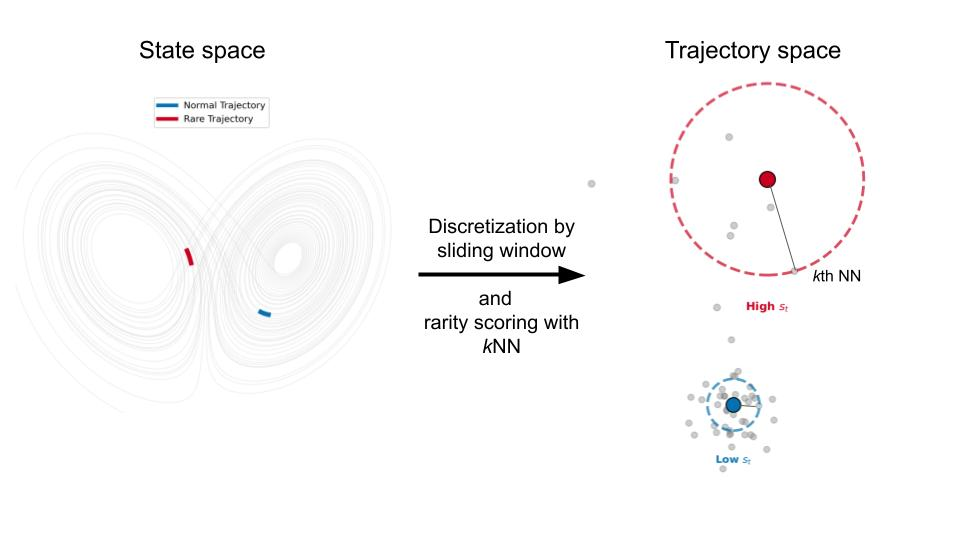
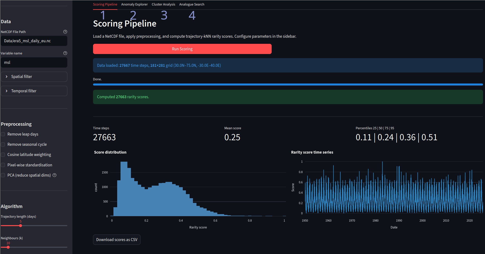

# TRAKNN: Spatiotemporal Anomaly Detection

[](LICENSE)

> Detect rare and anomalous weather patterns in climate data using trajectory-based k-nearest neighbors (kNN). Built with PyTorch for fast CPU and GPU computation.



---

## What is TRAKNN?

TRAKNN identifies unusual weather patterns in historical climate data by comparing how atmospheric conditions evolve over time. Instead of looking at individual days, it examines **trajectories** (sequences of consecutive weather maps) to find patterns that rarely occur in the historical record.

**Key idea:** If a weather pattern has no close historical matches, it's likely anomalous and potentially associated with extreme events like heatwaves, storms, or floods.

### Why trajectories?

Weather evolves continuously. A single day's snapshot might look normal, but the sequence of events leading up to it could be unprecedented. By comparing multi-day trajectories instead of single snapshots, TRAKNN captures the temporal dynamics that make certain weather events exceptional.

---

## Key Features

- **GPU accelerated** - PyTorch implementation scales to multi-decade datasets
- **Climate-ready** - Built-in handling of seasonal cycles, leap days, and latitude weighting
- **Interactive Explorer** - Streamlit GUI for visual analysis 

---

## Installation

### Basic Setup

```bash
# Create conda environment
conda env create -f environment.yml
conda activate trajectory_knn

# Install package
pip install -e .
```

### Optional: FAISS (for benchmarking only)

```bash
# CPU variant
conda env create -f env_faiss_cpu.yml

# GPU variant
conda env create -f env_faiss_gpu.yml
```

---

## Quick Start

### Option 1: Interactive Explorer

Launch the graphical interface:

```bash
streamlit run Explorer/app.py
```

The Explorer opens in your browser with an intuitive interface. Configure your data and analysis parameters in the sidebar, then explore results across four tabs. A video walkthrough is available online [here](https://www.youtube.com/watch?v=pxfyeH_pRlk&feature=youtu.be).

### Option 2: Python API

```python
from src.rarity_scoring_base import knn_scores

# Compute anomaly scores
scores = knn_scores(
    nc_path="Data/era5_msl_daily_eu.nc",
    var="msl",
    traj_length=5,       # days per trajectory
    k=10,                # nearest neighbors to consider
    q_batch=1024,        # tune based on GPU memory
    r_chunk=1024,
    device="cuda",       # or "cpu"
    exclusion_zone=10    # avoid trivial temporal matches
)

# Higher scores = more anomalous
```

### Option 3: Command Line

```bash
python case_studies/score.py \
    --file_path Data/era5_msl_daily_eu.nc \
    --parameter msl \
    --traj_length 5 \
    --k 10 \
    --device cuda \
    --remove_seasonal_cycle \
    --cos_lat_weighting
```

---

## How It Works

TRAKNN follows a simple 5-step process:

### 1. Load and Preprocess Data (Optional)
- Remove leap days for consistent 365-day years
- Subtract seasonal cycle (365-day climatology)
- Apply latitude weighting to correct for Earth's spherical geometry
- Standardize each grid point to unit variance
- Optional: Reduce dimensions with PCA

### 2. Compute Spatial Distances
Calculate how different each daily weather map is from every other day in the dataset. This creates a matrix of pairwise distances.

### 3. Build Trajectory Distances
For multi-day trajectories (e.g., 5-day sequences), compute distances efficiently using a sliding window approach. A clever recurrence relation avoids redundant calculations.

### 4. Find Nearest Neighbors
For each trajectory, identify the k most similar historical trajectories, excluding nearby dates (temporal exclusion zone) to avoid trivial matches.

### 5. Score Anomalies
Average the distances to the k-nearest neighbors. High scores indicate rare patterns with few historical analogues.

---

## TRAKNN Explorer (Interactive GUI)

The Explorer provides a no-code interface for the complete analysis workflow.



### Launch

```bash
streamlit run Explorer/app.py
```

### Sidebar Controls

All parameters are configured in the left sidebar:

- **Data Selection**: Choose netCDF file and variable name
- **Spatial/Temporal Filters**: Crop region and time range
- **Preprocessing Options**:
  - Remove leap days
  - Remove seasonal cycle
  - Cosine latitude weighting
  - Pixel-wise standardization
  - PCA dimensionality reduction
- **Algorithm Parameters**:
  - Trajectory length (1-X days)
  - Number of neighbors k
  - Temporal exclusion zone
  - Algorithm variant (base/exclusion/interval)
  - Device (CPU/CUDA)

### Tab 1: Scoring Pipeline

**Purpose:** Compute and visualize anomaly scores

**Features:**
- Run the detection algorithm with current parameters
- View time series of anomaly scores
- Identify top anomalous dates
- Export results to CSV

**Workflow:**
1. Configure parameters in sidebar
2. Click "Run Scoring" button
3. View score distribution and timeline
4. Examine top anomalies in sortable table

### Tab 2: Anomaly Explorer

**Purpose:** Visualize detected anomalies on maps

**Features:**
- Select a date from dropdown 
- View spatial field for that date as a heatmap
- See anomaly score and rank

**Use case:** After identifying high-scoring dates in Tab 1, explore their spatial structure here.

### Tab 3: Cluster Analysis

**Purpose:** Group similar anomalous patterns

**Features:**
- Apply K-means clustering to top anomalies
- Choose embedding method (PCA, raw fields, or custom)
- Set number of clusters
- View composite maps for each cluster
- Examine which dates belong to each cluster
- Export cluster assignments

**Use case:** Categorize extreme events into weather types (e.g., "Atlantic storms" vs "blocking highs").

**Workflow:**
1. Ensure scores are computed (Tab 1)
2. Choose number of top anomalies to cluster
3. Select clustering method and number of clusters
4. Click "Run Clustering"
5. Explore cluster composites and membership

### Tab 4: Analogue Search

**Purpose:** Find historical matches for a specific date

**Features:**
- Enter a query date
- Find the k most similar historical periods
- View spatial maps of analogues
- See distance scores to each analogue
- Configurable exclusion zone to avoid nearby dates

**Use case:** Given an extreme event, find past occurrences of similar atmospheric configurations.

**Example:** "What historical periods most resembled the 2003 European heatwave?"

---

## Working with Your Data

TRAKNN expects netCDF files with daily climate data in standard format:

```python
# Required dimensions
time: (T,)      # datetime64 timestamps
lat: (H,)       # latitude coordinates
lon: (W,)       # longitude coordinates

# Required variable
your_var: (T, H, W)  # e.g., temperature, pressure, etc.
```

Compatible with ERA5, CMIP6, and most climate model outputs.

---

## Advanced Usage

### Custom Preprocessing Pipeline

```python
import xarray as xr
from src.preprocessing import (
    remove_bisex_dailydata,
    remove_seasonal_cycle365,
    cos_lat_weighting,
    pixelwise_standardize,
)

# Load data
ds = xr.open_dataset("Data/era5_msl_daily_eu.nc")
data = ds["msl"].values  # shape (T, H, W)
time = ds["time"].values

# Apply preprocessing steps
data, time = remove_bisex_dailydata(data, time)
data = remove_seasonal_cycle365(data, time)
data = cos_lat_weighting(data, ds["lat"].values, len(ds["lon"]))
data = pixelwise_standardize(data)
```

### Find Historical Analogues

```python
from src.analogue_traj import find_analogues

# Find patterns similar to a specific date
analogues = find_analogues(
    nc_path="Data/era5_msl_daily_eu.nc",
    var="msl",
    query_date="2003-08-12",  # European heatwave
    k=20,                     # top 20 matches
    traj_length=5,
    exclusion_zone=30         # exclude ±30 days
)
```

---

## Applications

### Climate Extremes Detection

Identify unprecedented heatwaves, cold spells, droughts, and storms:

```bash
python case_studies/score.py \
    --file_path Data/t2m_daily_1950_2023.nc \
    --parameter t2m \
    --traj_length 7 \
    --k 10
```

### Storm Event Matching

Match detected anomalies to disaster databases:

```bash
# Match to EM-DAT storm events
python case_studies/emdat_storm_matching.py

# Compare against random baseline
python case_studies/storm_matching_random.py
```

### Weather Regime Analysis

Categorize circulation patterns using cluster analysis:

```bash
python case_studies/cluster_analysis.py \
    --file_path Data/z500_daily.nc \
    --date_path top_anomalies.csv \
    --n_clusters 4
```

---

## Project Structure

```
.
├── src/                                  # Core algorithms
│   ├── rarity_scoring_base.py           # Main kNN anomaly detection
│   ├── rarity_scoring_exclusion.py      # Variant with strict exclusion zones
│   ├── rarity_scoring_interval.py       # Interval-based scoring
│   ├── distance_matrix.py               # Full distance matrix computation
│   ├── analogue_traj.py                 # Historical analogue search
│   ├── intrinsic_dimension.py           # Dimensionality estimators
│   ├── preprocessing.py                 # Data preparation utilities
│   └── utils.py                         # Helper functions
│
├── Explorer/                             # Interactive Streamlit app
│   ├── app.py                           # Main application
│   ├── tab_scoring.py                   # Scoring pipeline tab
│   ├── tab_anomaly.py                   # Anomaly visualization tab
│   ├── tab_cluster.py                   # Clustering analysis tab
│   ├── tab_analogue.py                  # Analogue search tab
│   ├── data_utils.py                    # Data loading helpers
│   └── plot_utils.py                    # Plotting functions
│
├── case_studies/                         # Real-world applications
│   ├── score.py                         # CLI scoring script
│   ├── cluster_analysis.py              # Clustering pipeline
│   ├── emdat_storm_matching.py          # Storm event validation
│   └── results/                         # Output directory
│
├── experiments/                          # Performance benchmarks
│   ├── myalgo.py                        # Main algorithm benchmark
│   ├── myalgo_lowmem.py                 # Low-memory variant
│   ├── faiss_cpu_only.py                # FAISS CPU baseline
│   ├── faiss_gpu_only.py                # FAISS GPU baseline
│   ├── k_scaling.py                     # Scaling experiments
│   └── memory.py                        # Memory profiling
│
└── test/                                 # Unit tests
    ├── exact_knn.py
    └── exact_knn_traj.py
```

---

## Performance Tips

### GPU Memory

If you run out of GPU memory, reduce batch sizes:

```python
scores = knn_scores(
    ...,
    q_batch=256,   # reduce from 1024
    r_chunk=256,   # reduce from 1024
)
```

### Large Datasets

For very long time series, consider:
- Spatial cropping to region of interest
- Temporal subsetting (e.g., analyze by decade)
- Dimensionality reduction (PCA) 

---

## Citation

If you use this work in your research, please cite:

- Algorithm paper
    > Guillaume Coulaud and Davide Faranda. Traknn: Efficient trajectory aware spatiotemporal knn for rare meteorological trajectory detection, 2026. https://arxiv.org/abs/2603.02059.
    ```bibtex
    @misc{coulaud2026traknnefficienttrajectoryaware,
        title={TRAKNN: Efficient Trajectory Aware Spatiotemporal kNN for Rare Meteorological Trajectory Detection},
        author={Guillaume Coulaud and Davide Faranda},
        year={2026},
        eprint={2603.02059},
        archivePrefix={arXiv},
        primaryClass={stat.ML},
        url={https://arxiv.org/abs/2603.02059},
    }
    ```
- Athmospheric application paper
    > Guillaume Coulaud and Davide Faranda. Unsupervised data-driven detection of exceptional atmospheric trajectories, 2026. https://inria.hal.science/hal-05532887.
    ```bibtex
    @misc{coulaud:hal-05532887,
        title={Unsupervised data-driven detection of exceptional atmospheric trajectories},
        author={Coulaud, Guillaume and Faranda, Davide},
        url={https://inria.hal.science/hal-05532887},
        year={2026},
        hal_id={hal-05532887},
    }
    ```

---

## License

This project is licensed under the [CeCILL Free Software License Agreement](LICENSE) (compatible with GNU GPL).

---

## Contact

**Guillaume Coulaud**
Email: coulaud@duck.com

